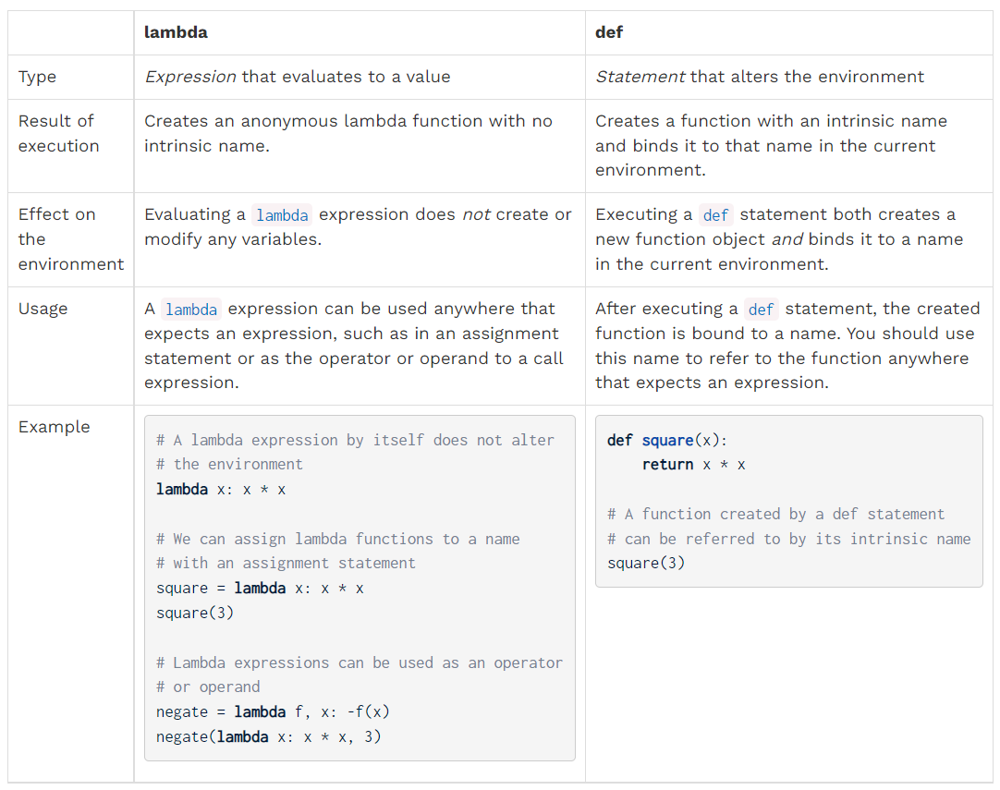

# Notes for CS61A Week1

## Lecture 1

### Take away from slides

Operators and operands are also expressions. Based on the defintion given in the lecture, ``expressions in programs evaluate to values``. In any programming language, is ``anything can be evaluated to values`` an expression?


The evaluation of an expression can be summarized into the following steps:
* evaluate the operator
* evalute the operand(s)
* apply operand(s) to operator


NOTE: The detailed parsing process of expressions or the operators and operands is more related to compiler or interpretor (for scripting language like Python)

Nested call expressions ``add(add(6, mul(4, 6)), mul(3, 5))``. What is the order for Python to evaluate this expression? Actually, there is nothing special. Based on the above steps, recursively applying the rule can lead to the final result.
* operator add, operand 1 add(6, mul(4, 6)), operand 2 mul(3, 5)
* (order of evaluating two operands?) operator add, operand 1 6, operand 2 mul(4, 6)
* ...


## Take away from codes
Nothing special...


## Lecture 2
### Take away from slides

Dicussion Question 1:
```python
f = min
f = max
g, h = min, max
max = g
max(f(2, g(h(1, 5), 3)), 4)
```

Solution:
* Most popular implementation of Python language specifications is CPython
* ``f = min``, ``min`` is a function. ``f`` should be understood as a **Name**, which is bound to the function.
* Answer should be ``3``: ``f`` is the bound name to the ``max`` function, ``g`` is the name bound to the ``min`` function, ``h`` is the name bound to the ``max`` function, ``max`` is the name bound to the ``min`` function. ``f = max`` is not affected, as ``f`` is bound to the function of ``max`` but not of the name ``max``. 
* Anything appearing on the left side of ``=`` is a **Name**, which is bound to the right operand.


  

Further reading:  [Understanding the concept of variables in Python](https://realpython.com/python-variables/)

<!-- Of course you can also understand it as a reference or pointer associated with the right operand, but I personally prefer to understand it as the Name -->


Calling User-defined Functions

* function name is globally visible
* Add a local frame, forming a new environment
* Bind the function's formal parameters to its arguments in that frame
* Execute the body of the function in that new environment
* Return an expression


Looking Up Names in Environments

* Every expression is evaluated in the context of an environment
* An environment is a sequence of frames
* A name evaluates to the value bound to that name in the earliest frame of the current environment in which that name is found.


## Take away from Codes
* ``Operator`` library: https://docs.python.org/3/library/operator.html


## Lecture 3
### Take away from slides

```Python
def end(n: int, d: int) -> None:
  """Print the final digits of N in reverse order until D is found!
  
  >>> end(34567, 5)
  7
  6
  5
  """
  while n > 0:
    last, n = n % 10, n // 10
    print(last)
    if d == last:
      return None
```
* doc test:

**A Guide to Designing Functions**
* give each function exactly one job but make it apply to many related situations
  * To be added
* Don't repeat yourself(**DRY**): implement a process just once but execute it many times
  * This why the block of codes need to be assembled as a function :)


**Generalizing Patterns with Arguments**
* Find common structure allows for shared implementation
  * Shared implementation: the API must be the same at first?
  * Common structure: same process of implementating the functionality?


```Python
def if_(c, t, f):
  if c:
    return t
  else:
    return f

def real_square_root(x):
  return if_(x > 0, sqrt(x), 0.0)
```
* when evaluating the `if_(x > 0, sqrt(x), 0.0)` call expression, the three arguments are firstly evaluated before passing to the parameters. Thus, `sqrt(x)` throws an exception for negative numbers.

<!-- ### Take away from codes -->
```Python
>>> True and 13
13

>>> False or 0
0

>>> 0 or False or 2 or 1 / 0
2

```
* `True and 13`: Evaluate `True` Python interpretor does not output anything while evaluate `13` Pyhton interpretor output its value of `13`
* `0 or False or 2 or 1 / 0`: obtains `False` next `2` then `2` 
* NOTE: eavluate the logic expressions includes the evaluation of operands which could trigger the output


## Lecture 4
### Take away from slides
```Python
from collections.abc import Callable

def cube(k: int) -> int:
  return pow(k, 3)

def summation(n: int, term: Callable[[int], int]) -> int:
  """Sum the first n items of a sequence
  >>> summation(5, cube)
  225
  """
  total, k = 0, 1
  while k <= n:
    total, k = total + term(k), k + 1
  return total
```
* `term` is a parameter expected to be a function

```Python
from collections.abc import Callable

def make_adder(n: int) -> Callable[[], int]:
  """Return a function that takes one argument k and returns k + n.
  >>> add_three = make_adder(3)
  >>> add_three(4)
  7
  >>> make_adder(1)(2)
  """
  def adder(k):
    return k + n
  return adder
```
* Here function acts the return values (which can be understood in the same way as the pointer to function in C++)
* NOTE: returned function including its **local frame** (for example, in the doc test, add_three is bound to one environment in which n is always 3)
* Functions defined within other function bodies (nested functions, which are not supported in C++) are bound to names in the closest local frame (not visible externally if no same name function exists...)


```Python
def square(x):
  return x * x

def make_adder(n):
  def adder(k):
    return k + n
  return adder

def compose1(f, g):
  def h(x):
    return f(g(x))
  return h

compose1(square, make_adder(2))(3)
```
* Parameters pass: in function of `compose1`, `x` can be considered as `k` in `make_adder` and `x` in `square`

**Functional Abstractions**

API Compositions:
* Input: what are the parameters when invoking the functions?
* Output: what are the outputs after giving required inputs?
* Hidden: how the output is obtained by using the input?


**Naming Convention**
* Names should convey the meaning or purpose of the values to which they are bound
* Types of value bound to the name are best documented in a function's docstring.
* Fundtion names typically convey their effect (verb ? liek print), their behavior (triple), or the value returned (abs).

**When binding the value with a name**
* repeated compound expressions are best named
* meaningful parts of complex expressions are best named
```Python
# if sqrt(square(a) + square(b)) > 1:
hypotenuse = sqrt(square(a) + square(b))
if hypotenuse > 1:
  x = x + hypotenuse

discriminant = square(b) - 4 * a * c
x1 = (-b + sqrt(discriminant)) / (2 * a)
```


## Lambda Expressions

Basic Syntax:
```Python
# lambda <parameters>: <return expressions>
lambda x: x * x # anonymous function
(lambda x: x * x)(10)
square = lambda x: x * x
square(10)
```

**Comparison between lambda expressions and functions**

Link: https://inst.eecs.berkeley.edu/~cs61a/fa20/lab/lab02/




NOTE:

``emphasize the fact that the difference between ``lambda``  expressions and  ``def`` statements is that  ``lambda``  expressions do not create any new bindings in the environment.``
* Here an anonymous and a non-anonymous lambda expression with the same functionality are created, the anonymous one does not create any new-binding in the environment. (Of course, there is something happening in the memory, but this non-referenced object should be re-cycled by the GC mechanisim -> **Te be updated**)